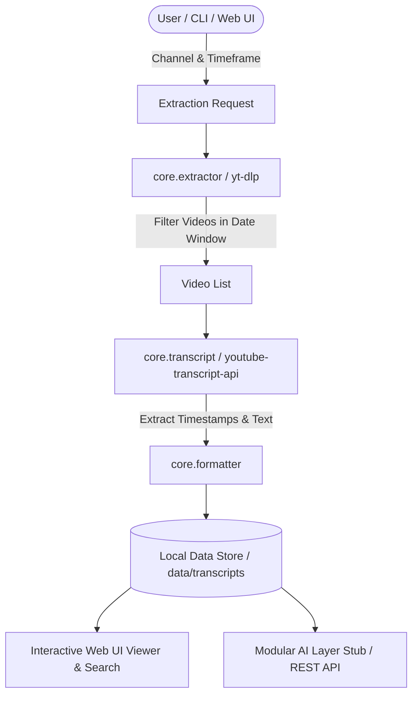

# YouTube Channel Research & Transcript Extractor

A modular tool to extract recent video metadata and timestamped transcripts from YouTube channels (default target: `@theAIsearch` for past 3 months), featuring a headless Python CLI core, FastAPI server, and a modern dark Web UI.

```
yt-research/
├── core/                   # Headless Python core engine
│   ├── extractor.py        # Video discovery & date filtering via yt-dlp
│   ├── transcript.py       # Timestamped transcript extraction & fallbacks
│   ├── formatter.py        # Markdown, SRT, TXT, JSON formatting
│   ├── storage.py          # Data persistence & channel index
│   └── cli.py              # Command-line interface
├── server/                 # FastAPI REST API & Static Server
│   └── app.py              # API routes & job runner
├── web/                    # Modern Web Frontend
│   ├── index.html          # SPA Layout & controls
│   ├── styles.css          # Glassmorphic dark design system
│   └── app.js              # State management & real-time polling
├── data/                   # Local transcript storage
├── pyproject.toml          # Project dependencies
└── README.md
```

## System Workflow



## Quick Start

### 1. Run Headless CLI Extraction

Extract videos and transcripts for `@theAIsearch` for the past 3 months (90 days):

```bash
uv run python -m core.cli --channel "@theAIsearch" --period 3m
```

Options:
- `--channel`: Handle or URL (e.g., `@theAIsearch`, `https://www.youtube.com/@theAIsearch`)
- `--period`: Timeframe window (`1m`, `3m`, `6m`, `1y`, `30d`, `90d`). Default: `3m`
- `--format`: Export format (`md`, `srt`, `txt`, `json`)
- `--output-dir`: Export target directory

### 2. Run Web UI & API Server

Launch the FastAPI web application server:

```bash
uv run uvicorn server.app:app --host 127.0.0.1 --port 8000 --reload
```

Then open `http://127.0.0.1:8000` in your web browser.

## Key Features

- **Headless Core**: Command-line interface with explicit exit codes and machine-readable output.
- **Date Window Filtering**: Filters videos based on publication date relative to specified timeframe.
- **Timestamped Transcripts**: Clickable timestamp links that jump directly to YouTube at exact seconds (`https://youtu.be/<id>?t=<sec>`).
- **Export Capabilities**: Multi-format exporter supporting Markdown with timestamps, SRT subtitles, Plain text, and JSON.
- **Modular AI Layer**: Prepared REST endpoint (`POST /api/ai/analyze`) and UI workspace ready for local AI tools (Ollama, LM Studio) or cloud model APIs.
